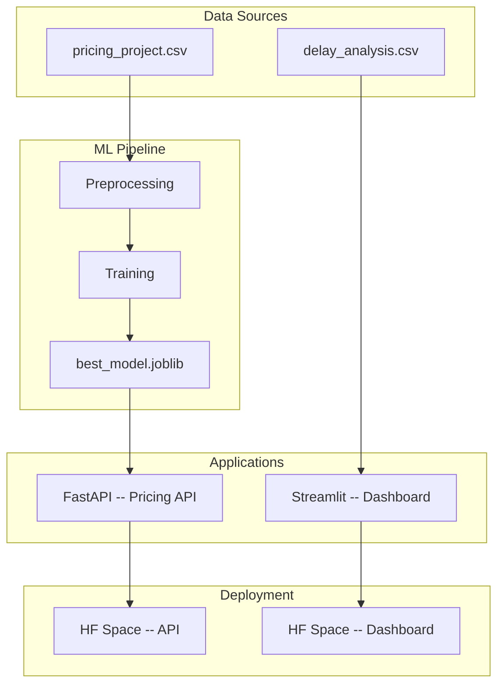
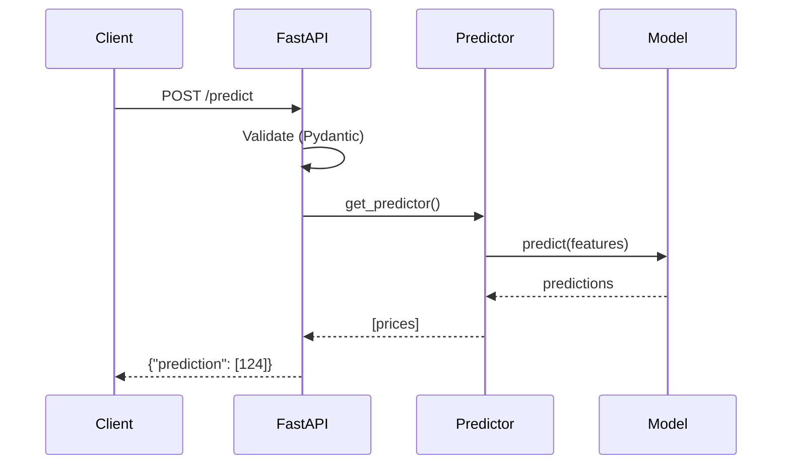
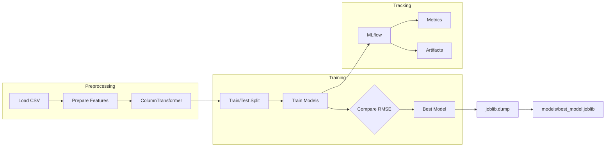
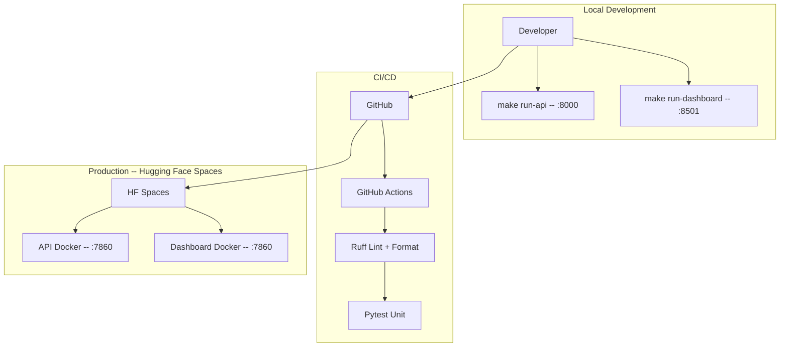
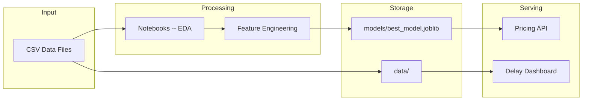

# Architecture

## System Overview



## API Flow



## ML Pipeline



Three models are compared: LinearRegression, RandomForestRegressor, GradientBoostingRegressor. The best model (lowest RMSE) is serialized as a scikit-learn Pipeline (preprocessor + model) using joblib.

## Project Structure

```
getaround/
    .github/workflows/ci.yml    # GitHub Actions: lint + unit tests
    data/
        get_around_delay_analysis.csv
        get_around_pricing_project.csv
    deploy/
        DEPLOYMENT.md
        hf-api/
            Dockerfile
            README.md
            .dockerignore
            .gitattributes
            .gitignore
        hf-dashboard/
            Dockerfile
            README.md
            .dockerignore
            .gitignore
    docs/
        ARCHITECTURE.md           # this file
    models/                       # gitignored, generated by `make train`
        best_model.joblib
    mlruns/                       # gitignored, MLflow tracking data
    notebooks/
        00_assignment.ipynb
    src/
        __init__.py
        api/
            __init__.py
            main.py               # FastAPI app with lifespan, CORS, /health
            routers/
                __init__.py
                predict.py        # POST /predict endpoint
            schemas/
                __init__.py
                prediction.py     # Pydantic request/response models
        config/
            __init__.py
            settings.py           # Pydantic Settings, env-based config, logging
        dashboard/
            __init__.py
            app.py                # Streamlit delay analysis + pricing demo
        ml/
            __init__.py
            predict.py            # PricingPredictor singleton, joblib loading
            preprocessing.py      # Feature definitions, ColumnTransformer
            train.py              # MLflow experiment, model comparison
    tests/
        __init__.py
        factories.py              # Factory Boy: CarFeatures, LuxuryCar, BudgetCar
        unit/
            __init__.py
        integration/
            __init__.py
    .env.example
    .gitignore
    .pre-commit-config.yaml
    .python-version               # 3.11
    Makefile
    pyproject.toml
    uv.lock
```

## Dependencies

Defined in the root `pyproject.toml`. Package name: `getaround`.

### Production

| Package | Version | Purpose |
|---------|---------|---------|
| fastapi | ~0.115.0 | REST API framework |
| uvicorn[standard] | ~0.30.0 | ASGI server |
| streamlit | ~1.40.0 | Dashboard framework |
| scikit-learn | ~1.5.0 | ML models and preprocessing |
| pandas | ~2.2.0 | Data manipulation |
| pydantic | ~2.10.0 | Request/response validation |
| pydantic-settings | ~2.10.0 | Environment-based configuration |
| numpy | ~1.26.0 | Numerical computation |
| plotly | ~5.24.0 | Interactive charts |
| httpx | ~0.27.0 | HTTP client (dashboard calls API) |
| joblib | >=1.0 | Model serialization |

### Dev only (dependency-groups.dev)

| Package | Purpose |
|---------|---------|
| ruff | Linting and formatting |
| pytest, pytest-cov | Testing |
| pre-commit | Git hooks |
| jupyter, ipykernel | Notebooks |
| factory-boy | Test data generation |
| mlflow ~2.19.0 | Experiment tracking (training only) |

## Configuration

Environment-based via `pydantic-settings`. Settings loaded from `.env` file and environment variables (env vars take precedence).

Key settings: `ENVIRONMENT` (development/testing/production), `LOG_LEVEL`, `API_URL`, `API_HOST`, `API_PORT`, `DASHBOARD_PORT`, `MLFLOW_TRACKING_URI`, `DATA_DIR`, `MODELS_DIR`.

Logging is configured per environment (DEBUG for dev, WARNING for test, INFO for production).

## Deployment Architecture



### Assemble-on-deploy strategy

Deploy directories (`deploy/hf-api/`, `deploy/hf-dashboard/`) contain only HF Spaces metadata: `Dockerfile`, `README.md`, `.dockerignore`, and gitignore/gitattributes files. They do not duplicate source code, models, data, or dependency files.

At deploy time, source files are assembled from the project root into a temporary directory (`.tmp/`, gitignored) along with the deploy-specific Dockerfile. The Dockerfiles reference the root `pyproject.toml` and `uv.lock` for dependency installation, and selectively `COPY` only the `src/` modules needed by each application:

- **API Dockerfile**: copies `src/api/`, `src/ml/` (predict + preprocessing only), `src/config/`, and `models/`.
- **Dashboard Dockerfile**: copies `src/dashboard/`, `src/config/`, and `data/`.

Both Dockerfiles use a multi-stage build (builder stage installs deps with `uv sync --no-group dev --frozen`, production stage runs as non-root user uid 1000).

### HF Spaces URLs

| Space | URL |
|-------|-----|
| API | `https://sam-bot-get-around-api.hf.space` |
| Dashboard | `https://sam-bot-get-around-dashboard.hf.space` |

## Makefile Targets

| Target | Description |
|--------|-------------|
| `make install-prod` | Install production dependencies (`uv sync --no-group dev`) |
| `make install-dev` | Install all dependencies including dev group |
| `make lint` | Run ruff check on src/ and tests/ |
| `make format` | Run ruff format + fix on src/ and tests/ |
| `make test` | Run pytest |
| `make train` | Train models with MLflow tracking, saves `models/best_model.joblib` |
| `make run-api` | Start FastAPI on :8000 with reload |
| `make run-dashboard` | Start Streamlit on :8501 |
| `make deploy-api` | Deploy API to HF Spaces (see deploy/DEPLOYMENT.md) |
| `make deploy-dashboard` | Deploy dashboard to HF Spaces (see deploy/DEPLOYMENT.md) |
| `make deploy-all` | Deploy both |
| `make clean` | Remove __pycache__, .pyc, .pytest_cache, .ruff_cache |

## CI Pipeline

GitHub Actions (`.github/workflows/ci.yml`) runs on push/PR to main:

1. **lint** job: checkout, setup Python 3.11, install uv, `uv sync`, run `ruff check` and `ruff format --check`.
2. **test** job (depends on lint): same setup, run `uv run pytest tests/unit -v`.

## Data Flow



## Gitignored Artifacts

| Path | Content |
|------|---------|
| `models/` | Trained model (generated by `make train`) |
| `mlruns/` | MLflow experiment tracking data |
| `.tmp/` | Temporary deploy assembly directory |
| `.venv/` | Python virtual environment |
| `.env` | Environment variables (`.env.example` tracked) |
| `.doc/` | Project documentation (not shipped) |
